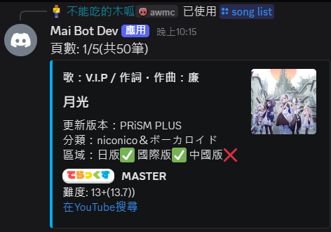
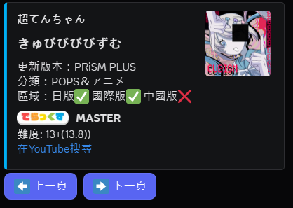
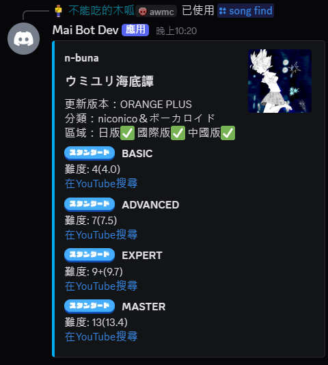

# maimai-bot
一個使用py-cord的Discord maimai機器人

## 功能
### 歌曲相關
- `/song random` - 根據條件隨機抽取歌曲
- `/song list` - 根據條件以每頁 10 首歌列出歌曲
- `/song find` - 搜尋指定歌曲的詳細資訊
- `/song update` - 更新歌曲資料庫

#### 可選條件
可用於 `random` 與 `list` 指令：
  - 歌曲難度(1.0 ~ 15.0)
  - 指定版本(maimai ~ CiRCLE PLUS)
  - 指定類型(STD / DX)
  - 指定區域(日服 / 國際服 / 中國服)

### 帳號綁定
- `/link <好友代碼>` - 使用好友代碼綁定帳號
- `/unlink` - 解除綁定帳號

### 成績查詢
- `/score <歌曲名稱> [難度]` - 查詢自己指定歌曲的分數
- `/top rating <全球/機器人> [數量]` - 查詢全球或綁定者的rating排行
- `/top song <全球/機器人> <歌曲名稱> <難度> [數量]` - 查詢全球或綁定者的歌曲排行
- `/info [玩家]` - 查詢指定玩家綁定的個人資訊

## 需求

- Python 3.10 或以上
- Discord Bot Token
- 一個maimai DX NET的帳號

## 安裝方法
1. 下載專案

```bash
git clone https://github.com/peter995peter/mai-bot.git
cd mai-bot
```

2. 安裝依賴
```bash
pip install -r requirements.txt
```

3. 複製 `.env.example` 為 `.env`
```
DISCORD_TOKEN=你的Discord TOKEN
MaiNet_User=你的maimai DX NET帳號
MaiNet_Pass=你的maimai DX NET密碼
```

4. 啟動機器人

Windows
```bash
python bot.py
```
MacOS / Linux
```bash
python3 bot.py
```

## 指令說明與範例
### 歌曲相關
#### `/song random` 
- 用途: 根據條件隨機抽取歌曲
- 格式: `/song random [最低等級] [最高等級] [版本] [DX/STD] [難度] [數量]`

範例:
```
/song random 最低等級: 13 最高等級: 14 指定版本: PRiSM PLUS 指定類型: DX 指定難度: MASTER 指定區域: 國際版 數量: 2
用途: 從 PRiSM PLUS 抽 2 張 難度 MASTER 等級 13 ~ 14 的 DX 譜面
```


---
#### `/song list`
- 用途: 根據條件以每頁 10 首歌列出歌曲
- 格式: `/song list [最低等級] [最高等級] [版本] [DX/STD] [難度]`

範例:
```
/song list 最低等級: 13 最高等級: 14 指定版本: PRiSM PLUS 指定類型: DX 指定難度: MASTER 指定區域: 國際版 數量: 2
用途: 列出 PRiSM PLUS 難度 MASTER 等級 13 ~ 14 的全部 DX 譜面
```


> 中間太長剪掉了



---

#### `/song find`
- 用途: 搜尋指定歌曲的詳細資訊
- 格式: `/song find <歌曲名稱>`

範例:
```
/song find 歌曲名稱: ウミユリ海底譚
用途: 列出 ウミユリ海底譚 這首歌的詳細資訊
```


---

#### `/song update`
- 用途: 更新歌曲資料庫
- 格式: `/song update`

範例:
```
/song update
用途: 更新歌曲資料庫
```


## 專案結構
```
├── bot.py
├── cogs
│   ├── game.py
│   ├── link.py
│   ├── ping.py
│   ├── song.py
│   └── top.py
├── data
│   ├── cache
│   ├── link.json
│   ├── page.json
│   └── songs.json
├── fun
│   ├── link.py
│   ├── mainet.py
│   └── songs.py
├── LICENSE
├── README.md
├── requirements.txt
└── .env

```

## 資料來源
定數資料庫 / 日服收錄資訊：[音ゲーツール置き場](https://reiwa.f5.si/)

國際服收錄資訊：[官方網站](https://maimai.sega.com/)

中國服收錄資訊：[CrazyKidCN/maimaiDX-CN-songs-database](https://github.com/CrazyKidCN/maimaiDX-CN-songs-database)


## 授權
此專案採用 MIT License，詳見 [LICENSE](LICENSE) 檔案。
